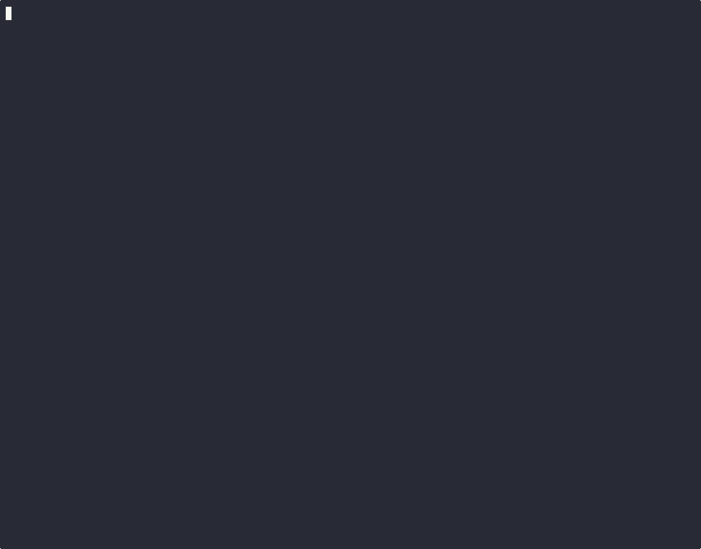

# BpfJailer - eBPF Mandatory Access Control

> **Warning**: This project is under heavy development and is **NOT ready for production use**. APIs, policy formats, and behavior may change without notice. Use for testing and experimentation only.

# Community
[](https://discord.gg/jzsW5Q6s9q)
[](https://arxignis.substack.com/)

BpfJailer is an eBPF-based process jailing system that provides mandatory access control (MAC) for Linux. It tracks processes using BPF task_storage maps and enforces role-based policies on file access, network operations, and process execution.

## Features (Current Version)

| Feature | Status | Description |
|---------|--------|-------------|
| Process Tracking | ✅ Working | Tracks processes using `task_storage` BPF map |
| Socket Enrollment | ✅ Working | Processes enroll via Unix socket API |
| Role-based Policies | ✅ Working | Restricted and permissive roles |
| File Access Control | ✅ Working | Block/allow file open operations |
| Jail Inheritance | ✅ Working | Child processes inherit parent's jail |
| Network Control | ✅ Working | Block/allow socket bind/connect |
| Port/Protocol Filtering | ✅ Working | Per-port TCP/UDP allow/deny rules |
| Exec Control | ✅ Working | Block/allow process execution |
| Path Matching | ✅ Working | Dentry walking with cache invalidation |
| Signed Binaries | 🚧 Stub | Binary signature validation (not implemented) |
| Alternative Enrollment | ✅ Working | Auto-enroll by executable, cgroup, or xattr |
| Daemonless Mode | ✅ Working | Bootstrap binary pins programs at early boot |
| Audit Events | ✅ Working | Perf buffer for systemd-journald integration |

## Nginx demo


## Complex demo
[](https://asciinema.org/a/767420)

## Kernel Requirements

### Minimum Kernel Version
- **Linux 5.11+** (for `BPF_MAP_TYPE_TASK_STORAGE` support)
- **Recommended: Linux 6.1+** (better BTF support)

### Required Kernel Configuration

```bash
# Check current kernel config
zcat /proc/config.gz 2>/dev/null || cat /boot/config-$(uname -r)
```

Required options:
```
CONFIG_BPF=y
CONFIG_BPF_SYSCALL=y
CONFIG_BPF_LSM=y
CONFIG_DEBUG_INFO_BTF=y
```

### Enable BPF LSM

BPF LSM must be enabled in the kernel boot parameters:

```bash
# Check if BPF LSM is active
cat /sys/kernel/security/lsm
# Should include "bpf" in the list

# If not, add to kernel boot parameters:
# Edit /etc/default/grub and add to GRUB_CMDLINE_LINUX:
#   lsm=lockdown,capability,landlock,yama,apparmor,bpf

# Then update grub and reboot:
sudo update-grub
sudo reboot
```

For Ubuntu/Debian systems, you can also use:
```bash
# Create a script to enable BPF LSM
cat > /tmp/enable_bpf_lsm.sh << 'EOF'
#!/bin/bash
GRUB_FILE="/etc/default/grub"
if grep -q "lsm=" "$GRUB_FILE"; then
    sudo sed -i 's/lsm=[^""]*/lsm=lockdown,capability,landlock,yama,apparmor,bpf/' "$GRUB_FILE"
else
    sudo sed -i 's/GRUB_CMDLINE_LINUX="\(.*\)"/GRUB_CMDLINE_LINUX="\1 lsm=lockdown,capability,landlock,yama,apparmor,bpf"/' "$GRUB_FILE"
fi
sudo update-grub
echo "BPF LSM enabled. Please reboot."
EOF
chmod +x /tmp/enable_bpf_lsm.sh
sudo /tmp/enable_bpf_lsm.sh
```

## Build

### Prerequisites

```bash
# Install Rust
curl --proto '=https' --tlsv1.2 -sSf https://sh.rustup.rs | sh

# Install build dependencies (Ubuntu/Debian)
sudo apt-get install -y clang llvm libelf-dev linux-headers-$(uname -r)

# Install BPF target for Rust
rustup target add bpfel-unknown-none
```

### Build All Components

```bash
cd bpfjail

# Build BPF programs
cd bpfjailer-bpf && cargo build --release && cd ..

# Build daemon and client
cargo build --release
```

## Quick Start

### 1. Start the Daemon

```bash
# Run as root (loads config/policy.json if present)
sudo RUST_LOG=info ./target/release/bpfjailer-daemon
```

Expected output:
```
[INFO] BpfJailer daemon starting...
[INFO] Loading BpfJailer eBPF programs with libbpf-rs...
[INFO] ✓ pending_enrollments map available for enrollment
[INFO] ✓ network_rules map available for port/protocol filtering
[INFO] ✓ task_storage map created successfully
[INFO] ✓ Program task_alloc attached
[INFO] ✓ Program file_open attached
[INFO] ✓ Program socket_bind attached
[INFO] ✓ Program socket_connect attached
[INFO] ✓ Program bprm_check_security attached
[INFO] Initialized with default roles: restricted (1), permissive (2)
[INFO] Loaded policy from config/policy.json
[INFO] Loaded 5 roles
[INFO] Enrollment server listening on /run/bpfjailer/enrollment.sock
```

### 2. Run Security Tests

```bash
# Run vulnerability tests WITHOUT jailing (shows attacks succeed)
sudo python3 tests/vulnerable_apps/run_tests.py

# Run vulnerability tests WITH restricted role (shows attacks blocked)
sudo python3 tests/vulnerable_apps/run_tests.py --role 1

# Run specific test
sudo python3 tests/vulnerable_apps/run_tests.py --role 1 --test path

# List available tests and roles
sudo python3 tests/vulnerable_apps/run_tests.py --list
```

**Example output with restricted role:**
```
============================================================
TEST: Path Traversal / Arbitrary File Read
============================================================
Attempting to read /etc/passwd via path traversal...
BLOCKED - Permission denied (BpfJailer blocked file access)

============================================================
TEST: Command Injection
============================================================
Attempting command injection...
BLOCKED - Permission denied (BpfJailer blocked exec)

============================================================
TEST: Reverse Shell / Data Exfiltration
============================================================
Test 1: Reverse shell connection to 127.0.0.1:4444
BLOCKED - Permission denied (BpfJailer blocked connect)
```

### Available Security Tests

| Test | Vulnerability | Mitigated By |
|------|--------------|--------------|
| `path_traversal` | Arbitrary file read via `../` | restricted, isolated |
| `command_injection` | Shell command execution | restricted, webserver, isolated |
| `reverse_shell` | Outbound connections to attacker | restricted, isolated |
| `ssrf` | Access internal services/cloud metadata | restricted, isolated |
| `arbitrary_write` | Write to sensitive paths | restricted |
| `crypto_miner` | Download + execute + connect to pool | restricted, webserver |
| `privilege_escalation` | Read shadow, write sudoers | restricted |

### 3. Manual Enrollment Test

```python
#!/usr/bin/env python3
import socket
import json
import os

# Connect to daemon
sock = socket.socket(socket.AF_UNIX, socket.SOCK_STREAM)
sock.connect("/run/bpfjailer/enrollment.sock")

# Enroll with restricted role (ID 1)
request = {"Enroll": {"pod_id": 1, "role_id": 1}}
sock.send((json.dumps(request) + "\n").encode())
response = sock.recv(4096).decode()
print(f"Enrollment: {response}")
sock.close()

# Try to read a file (should be blocked)
try:
    open("/etc/passwd").read()
    print("File access: ALLOWED")
except PermissionError:
    print("File access: BLOCKED")
```

## Policy File

BpfJailer loads roles from a JSON policy file. The daemon searches for the policy file in this order:

1. `$BPFJAILER_POLICY` environment variable
2. `/etc/bpfjailer/policy.json`
3. `config/policy.json` (relative to working directory)

### Example Policy File

```json
{
  "roles": {
    "restricted": {
      "id": 1,
      "name": "restricted",
      "flags": {
        "allow_file_access": false,
        "allow_network": false,
        "allow_exec": false
      },
      "network_rules": []
    },
    "webserver": {
      "id": 3,
      "name": "webserver",
      "flags": {
        "allow_file_access": true,
        "allow_network": true,
        "allow_exec": false
      },
      "network_rules": [
        {"protocol": "tcp", "port": 80, "allow": true},
        {"protocol": "tcp", "port": 443, "allow": true}
      ]
    }
  },
  "pods": []
}
```

### Policy Flags

| Flag | Description |
|------|-------------|
| `allow_file_access` | Allow file open operations |
| `allow_network` | Allow socket bind/connect |
| `allow_exec` | Allow process execution |
| `allow_setuid` | Allow setuid operations |
| `allow_ptrace` | Allow ptrace operations |

## Default Roles

| Role ID | Name | File Access | Network | Exec |
|---------|------|-------------|---------|------|
| 1 | restricted | Blocked | Blocked | Blocked |
| 2 | permissive | Allowed | Allowed | Allowed |
| 3 | webserver | Allowed | Ports 80, 443, 8080 | Blocked |
| 4 | database | Allowed | Ports 5432, 6379 | Blocked |
| 5 | isolated | Allowed | Blocked | Blocked |
| 6 | web_with_db | Allowed | Ports 80, 443, 5432, 3306, 6379 | Blocked |
| 7 | worker | Allowed | Ports 443, 5432, 6379, 5672 | Allowed |

## Network Port/Protocol Filtering

BpfJailer supports fine-grained network control with per-port TCP/UDP rules.

### Rule Structure

```
network_rules map:
  Key: { role_id, port, protocol, direction }
  Value: allowed (1) or denied (0)
```

- **protocol**: 6 = TCP, 17 = UDP
- **direction**: 0 = bind, 1 = connect
- **port**: 0 = wildcard (all ports)

### Rule Evaluation Order

1. Check specific port rule for the role
2. Check wildcard port rule (port=0) for the role
3. Fall back to role_flags (bit 1 = network allowed)

### Example: Allow Only HTTP/HTTPS for Restricted Role

```rust
// In daemon code:
use bpfjailer_daemon::process_tracker::{PROTO_TCP, DIR_CONNECT};

// Allow TCP connect to ports 80 and 443 only
process_tracker.add_network_rule(RoleId(1), 80, PROTO_TCP, DIR_CONNECT, true)?;
process_tracker.add_network_rule(RoleId(1), 443, PROTO_TCP, DIR_CONNECT, true)?;
```

### Protocol Constants

| Constant | Value | Description |
|----------|-------|-------------|
| `PROTO_TCP` | 6 | TCP protocol |
| `PROTO_UDP` | 17 | UDP protocol |
| `DIR_BIND` | 0 | socket bind() |
| `DIR_CONNECT` | 1 | socket connect() |

### Port Ranges

Port ranges can be specified in policy.json using `port_start` and `port_end`:

```json
{
  "network_rules": [
    {"protocol": "tcp", "port": 443, "allow": true},
    {"protocol": "tcp", "port_start": 8000, "port_end": 8100, "allow": true}
  ]
}
```

| Field | Description |
|-------|-------------|
| `port` | Single port (e.g., 80) |
| `port_start` + `port_end` | Port range (e.g., 8000-8100) |

> **Note**: Large ranges (>1000 ports) consume many BPF map entries. A warning is logged for ranges exceeding 1000 ports.

## Architecture

```
┌─────────────────────────────────────────────────────────────┐
│                     User Space                               │
├─────────────────────────────────────────────────────────────┤
│  ┌─────────────┐    ┌──────────────────┐                    │
│  │   Client    │───▶│  bpfjailer-daemon │                    │
│  │  (enroll)   │    │                  │                    │
│  └─────────────┘    │  - PolicyManager │                    │
│                     │  - ProcessTracker│                    │
│                     │  - EnrollmentSvr │                    │
│                     └────────┬─────────┘                    │
│                              │ writes to                    │
│                              ▼                              │
├─────────────────────────────────────────────────────────────┤
│                     BPF Maps                                 │
│  ┌──────────────────┐  ┌─────────────┐  ┌──────────────┐   │
│  │pending_enrollments│  │ role_flags  │  │ task_storage │   │
│  │   (PID → info)   │  │ (role→flags)│  │(task→info)   │   │
│  └──────────────────┘  └─────────────┘  └──────────────┘   │
├─────────────────────────────────────────────────────────────┤
│                     BPF LSM Hooks                            │
│  ┌────────────┐ ┌───────────┐ ┌─────────────┐ ┌──────────┐ │
│  │ task_alloc │ │ file_open │ │socket_bind/ │ │bprm_check│ │
│  │(inheritance│ │(migration │ │  connect    │ │_security │ │
│  │ + init)    │ │ + check)  │ │  (check)    │ │ (check)  │ │
│  └────────────┘ └───────────┘ └─────────────┘ └──────────┘ │
└─────────────────────────────────────────────────────────────┘
```

## Enrollment Flow

1. Process connects to `/run/bpfjailer/enrollment.sock`
2. Sends JSON: `{"Enroll": {"pod_id": N, "role_id": M}}`
3. Daemon writes to `pending_enrollments[PID]` and `role_flags[role_id]`
4. On next syscall (file_open, exec), BPF migrates enrollment to `task_storage`
5. All future syscalls check `task_storage` + `role_flags` for enforcement
6. Child processes inherit via `task_alloc` hook

## Installation Modes

BpfJailer supports two installation modes:

### 1. Daemon Mode (Standard)

Uses a running daemon for enrollment and policy management:

```bash
# Install systemd service
sudo cp config/bpfjailer-daemon.service /etc/systemd/system/
sudo cp target/release/bpfjailer-daemon /usr/sbin/
sudo mkdir -p /etc/bpfjailer
sudo cp config/policy.json /etc/bpfjailer/

# Enable and start
sudo systemctl daemon-reload
sudo systemctl enable bpfjailer-daemon
sudo systemctl start bpfjailer-daemon
```

**Features:**
- Socket-based enrollment API
- Hot policy reload (stop/start daemon)
- Full logging in daemon process

### 2. Daemonless Mode (Bootstrap)

Loads BPF programs at early boot and exits. Programs remain active until reboot:

```bash
# Install bootstrap service
sudo cp config/bpfjailer-bootstrap.service /etc/systemd/system/
sudo cp target/release/bpfjailer-bootstrap /usr/sbin/
sudo mkdir -p /etc/bpfjailer
sudo cp config/policy.json /etc/bpfjailer/

# Enable (will run at next boot)
sudo systemctl daemon-reload
sudo systemctl enable bpfjailer-bootstrap

# Or run manually now
sudo bpfjailer-bootstrap
```

**Features:**
- No running daemon (reduced attack surface)
- BPF programs pinned to `/sys/fs/bpf/bpfjailer/`
- Cannot be stopped without reboot
- Audit events sent to systemd-journald via perf buffer
- Only alternative enrollment methods work (exec/cgroup/xattr)

**Check pinned programs:**
```bash
ls -la /sys/fs/bpf/bpfjailer/
ls -la /sys/fs/bpf/bpfjailer/maps/
ls -la /sys/fs/bpf/bpfjailer/progs/
```

**View audit events:**
```bash
# Events are emitted to perf buffer, picked up by journald
journalctl -f | grep bpfjailer
```

### Mode Comparison

| Aspect | Daemon Mode | Daemonless Mode |
|--------|-------------|-----------------|
| Attack Surface | Running daemon | No running process |
| Enrollment | Unix socket + alternatives | Alternatives only |
| Policy Updates | Hot reload | Reboot required |
| Audit Logging | Daemon reads ringbuf | journald via perf buffer |
| Program Removal | Stop daemon | Reboot only |
| Boot Order | After network.target | Before basic.target |

## Troubleshooting

### "task_storage map creation failed"

```bash
# Check kernel version (needs 5.11+)
uname -r

# Check BPF LSM is active
cat /sys/kernel/security/lsm | grep bpf

# Check BTF is available
ls -la /sys/kernel/btf/vmlinux
```

### "Failed to attach program"

```bash
# Check if BPF programs can be loaded
sudo bpftool prog list

# Check capabilities
sudo capsh --print | grep cap_bpf
```

### Permission denied when enrolling

```bash
# Ensure daemon is running as root
ps aux | grep bpfjailer

# Check socket permissions
ls -la /run/bpfjailer/enrollment.sock
```

## Alternative Enrollment Methods

Beyond Unix socket enrollment, BpfJailer supports automatic enrollment based on:

### Executable-based Enrollment

Auto-enroll all processes executing a specific binary:

```json
{
  "exec_enrollments": [
    {
      "executable_path": "/usr/bin/nginx",
      "pod_id": 1000,
      "role": "webserver"
    }
  ]
}
```

When any process executes `/usr/bin/nginx`, it's automatically enrolled with the `webserver` role. This is matched by the executable's inode, so symlinks and hardlinks are handled correctly.

### Cgroup-based Enrollment

Auto-enroll all processes in a specific cgroup:

```json
{
  "cgroup_enrollments": [
    {
      "cgroup_path": "/sys/fs/cgroup/bpfjailer/sandbox",
      "pod_id": 2000,
      "role": "sandbox"
    }
  ]
}
```

Create the cgroup and move processes into it:

```bash
# Create cgroup
sudo mkdir -p /sys/fs/cgroup/bpfjailer/sandbox

# Move process to cgroup
echo $$ | sudo tee /sys/fs/cgroup/bpfjailer/sandbox/cgroup.procs

# Process is now auto-enrolled with sandbox role
```

### Xattr-based Enrollment

Set extended attributes on executables for enrollment info:

```bash
# Set enrollment xattrs
sudo setfattr -n user.bpfjailer.pod_id -v $(printf '\x01\x00\x00\x00\x00\x00\x00\x00') /path/to/binary
sudo setfattr -n user.bpfjailer.role_id -v $(printf '\x03\x00\x00\x00') /path/to/binary

# Check xattrs
getfattr -d /path/to/binary
```

### How Auto-Enrollment Works

1. **At exec time** (`bprm_check_security` LSM hook):
   - Check if executable's inode is in `exec_enrollment` map
   - Check if process's cgroup ID is in `cgroup_enrollment` map
   - If found, automatically set `task_storage` with pod_id and role_id

2. **Enrollment persists** through fork/exec via `task_alloc` hook

3. **Policy rules** (network, path, exec) are applied based on role_id

## License

GPL-2.0 (required for BPF programs)

## Acknowledgments

This project is based on the original idea and design by **Liam Wisehart** at **Meta**. Special thanks for the vision and foundational work that made BpfJailer possible.
